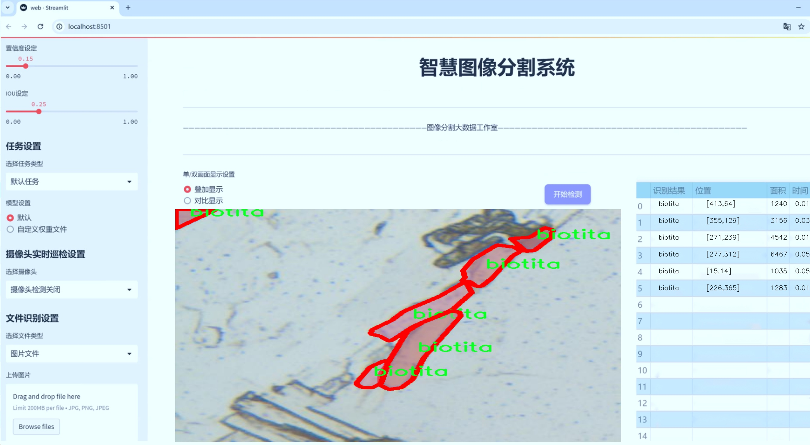
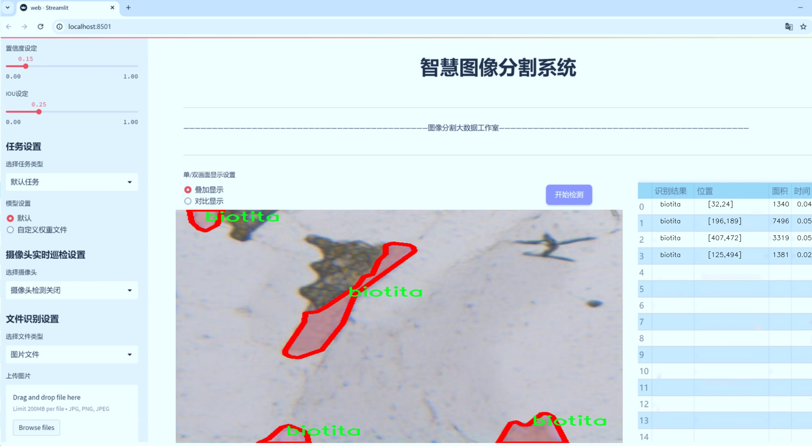
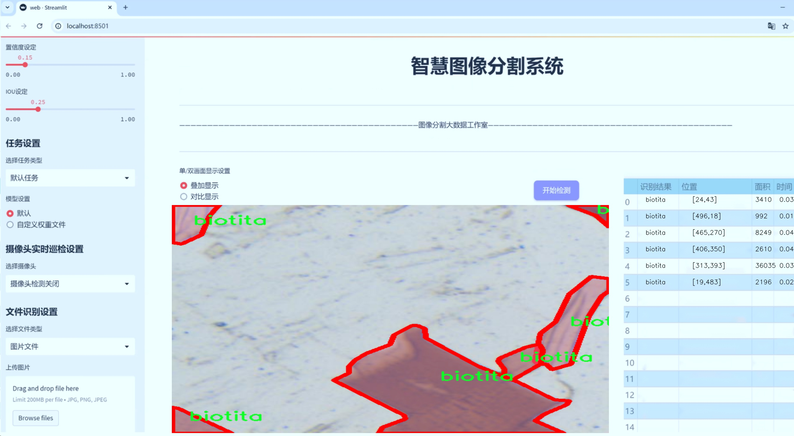
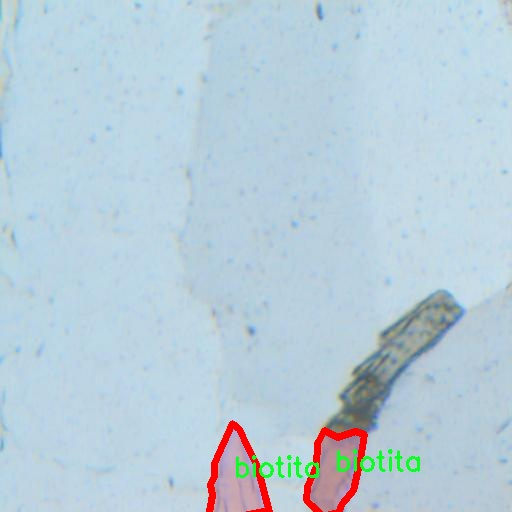
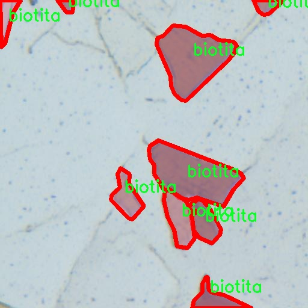
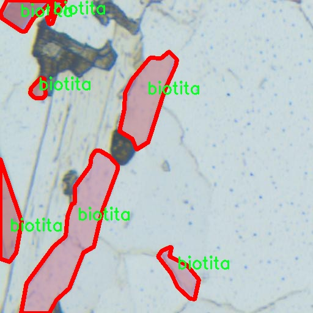
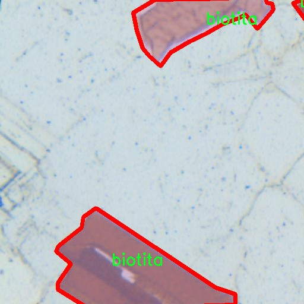
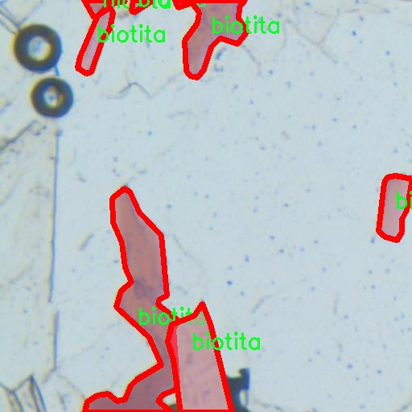

# 矿物分类图像分割系统： yolov8-seg-SPDConv

### 1.研究背景与意义

[参考博客](https://gitee.com/YOLOv8_YOLOv11_Segmentation_Studio/projects)

[博客来源](https://kdocs.cn/l/cszuIiCKVNis)

研究背景与意义

随着全球矿产资源的不断开发与利用，矿物分类与识别在地质学、矿业、环境监测等领域的重要性日益凸显。传统的矿物分类方法多依赖于人工观察与经验判断，然而这种方法不仅耗时耗力，而且容易受到主观因素的影响，导致分类结果的不准确性。近年来，随着计算机视觉技术的快速发展，基于深度学习的图像处理方法逐渐成为矿物分类领域的新兴研究方向。特别是YOLO（You Only Look Once）系列模型因其高效的实时检测能力而受到广泛关注。

YOLOv8作为YOLO系列的最新版本，具备了更强的特征提取能力和更高的分类精度，能够在复杂背景下快速准确地识别多种物体。通过对YOLOv8模型的改进，结合实例分割技术，可以实现对矿物图像的精细化处理。这种方法不仅能够识别矿物的种类，还能对矿物的形状和边界进行精确分割，为后续的矿物分析提供了丰富的信息。

本研究所使用的数据集“MineralVision”包含1200幅图像，涵盖了47种不同类别的矿物，如辉石、石英、长石等，涵盖了从常见矿物到一些特殊矿物的广泛范围。这些数据的多样性为模型的训练提供了良好的基础，能够有效提高模型的泛化能力和分类精度。此外，数据集中还包含了一些未知类别的矿物，这为模型的自适应学习提供了挑战与机遇，进一步推动了智能矿物分类系统的发展。

基于改进YOLOv8的矿物分类图像分割系统，不仅能够提升矿物识别的准确性，还能在实际应用中实现自动化与智能化，减少人工干预的需求。这对于矿业公司在资源勘探、开采及环境保护等方面具有重要的现实意义。通过实现高效的矿物分类与分割，可以帮助地质学家和矿业工程师更好地理解矿物的分布特征，从而优化资源利用和环境管理。

此外，本研究还具有重要的学术价值。通过对YOLOv8模型的改进与应用，可以为计算机视觉领域的研究提供新的思路和方法，推动深度学习技术在矿物分类中的应用。研究成果不仅能够丰富矿物学和地质学的理论体系，还能够为相关领域的研究者提供有价值的参考，促进跨学科的合作与交流。

综上所述，基于改进YOLOv8的矿物分类图像分割系统的研究，不仅在技术上具有创新性和实用性，同时也为矿业及相关领域的可持续发展提供了新的解决方案，具有重要的研究背景与深远的社会意义。

### 2.图片演示







注意：本项目提供完整的训练源码数据集和训练教程,由于此博客编辑较早,暂不提供权重文件（best.pt）,需要按照6.训练教程进行训练后实现上图效果。

### 3.视频演示

[3.1 视频演示](https://www.bilibili.com/video/BV14SUNYREZR/)

### 4.数据集信息

##### 4.1 数据集类别数＆类别名

nc: 1
names: ['biotita']


##### 4.2 数据集信息简介

数据集信息展示

在本研究中，我们采用了名为“MineralVision”的数据集，以训练和改进YOLOv8-seg的矿物分类图像分割系统。该数据集专注于生物矿物的识别与分割，尤其是针对“biotita”这一特定类别的图像数据。MineralVision数据集的设计旨在为矿物学研究提供高质量的图像数据支持，助力深度学习模型在矿物分类和分割任务中的表现。

MineralVision数据集的核心特点在于其独特的单类别设计。该数据集仅包含一个类别，即“biotita”，这使得其在训练过程中能够专注于这一特定矿物的特征提取与分割。生物云母（biotite）是一种常见的黑色或深褐色的矿物，广泛分布于多种岩石中，尤其是在花岗岩和片麻岩中。其独特的层状结构和光泽特性使得生物云母在矿物学研究中具有重要的地位。因此，MineralVision数据集的选择为研究者提供了一个专注于生物云母特征的理想平台。

在数据集的构建过程中，MineralVision团队致力于收集多样化的生物云母图像，确保其在不同光照、角度和背景下的表现。通过精心的图像采集和处理，数据集涵盖了生物云母的各种形态特征，包括其层状结构、颜色变化以及在不同矿物组合中的表现。这种多样性不仅增强了模型的泛化能力，也提高了其在实际应用中的有效性。

此外，MineralVision数据集还经过严格的标注过程，确保每张图像中的生物云母区域被准确地分割和标识。这一过程采用了专业的图像标注工具，结合矿物学专家的知识，确保了数据集的高质量和高准确性。这样的标注策略使得YOLOv8-seg模型在训练时能够获得清晰的目标区域信息，从而提升了其分割精度和分类能力。

在数据集的使用过程中，研究者可以通过对MineralVision数据集的深入分析，探索生物云母在不同环境下的特征表现，进而为矿物分类与分割算法的改进提供数据支持。通过结合YOLOv8-seg的强大特性，研究者能够实现对生物云母的高效检测与分割，为矿物学研究和相关应用提供新的思路和方法。

总之，MineralVision数据集不仅为矿物分类图像分割系统的训练提供了坚实的基础，也为后续的研究和应用奠定了良好的数据支持。随着深度学习技术的不断发展，利用这一数据集进行的研究将为矿物学领域带来新的突破和进展。通过不断优化和改进模型，研究者有望在生物云母的识别与分割方面取得更为显著的成果，为矿物学的研究和应用开辟新的方向。











### 5.项目依赖环境部署教程（零基础手把手教学）

[5.1 环境部署教程链接（零基础手把手教学）](https://www.bilibili.com/video/BV1jG4Ve4E9t/?vd_source=bc9aec86d164b67a7004b996143742dc)


[5.2 安装Python虚拟环境创建和依赖库安装视频教程链接（零基础手把手教学）](https://www.bilibili.com/video/BV1nA4VeYEze/?vd_source=bc9aec86d164b67a7004b996143742dc)

### 6.手把手YOLOV8-seg训练视频教程（零基础手把手教学）

[6.1 手把手YOLOV8-seg训练视频教程（零基础小白有手就能学会）](https://www.bilibili.com/video/BV1cA4VeYETe/?vd_source=bc9aec86d164b67a7004b996143742dc)


按照上面的训练视频教程链接加载项目提供的数据集，运行train.py即可开始训练



     Epoch   gpu_mem       box       obj       cls    labels  img_size
     1/200     0G   0.01576   0.01955  0.007536        22      1280: 100%|██████████| 849/849 [14:42<00:00,  1.04s/it]
               Class     Images     Labels          P          R     mAP@.5 mAP@.5:.95: 100%|██████████| 213/213 [01:14<00:00,  2.87it/s]
                 all       3395      17314      0.994      0.957      0.0957      0.0843

     Epoch   gpu_mem       box       obj       cls    labels  img_size
     2/200     0G   0.01578   0.01923  0.007006        22      1280: 100%|██████████| 849/849 [14:44<00:00,  1.04s/it]
               Class     Images     Labels          P          R     mAP@.5 mAP@.5:.95: 100%|██████████| 213/213 [01:12<00:00,  2.95it/s]
                 all       3395      17314      0.996      0.956      0.0957      0.0845

     Epoch   gpu_mem       box       obj       cls    labels  img_size
     3/200     0G   0.01561    0.0191  0.006895        27      1280: 100%|██████████| 849/849 [10:56<00:00,  1.29it/s]
               Class     Images     Labels          P          R     mAP@.5 mAP@.5:.95: 100%|███████   | 187/213 [00:52<00:00,  4.04it/s]
                 all       3395      17314      0.996      0.957      0.0957      0.0845


### 7.50+种全套YOLOV8-seg创新点加载调参实验视频教程（一键加载写好的改进模型的配置文件）

[7.1 50+种全套YOLOV8-seg创新点加载调参实验视频教程（一键加载写好的改进模型的配置文件）](https://www.bilibili.com/video/BV1Hw4VePEXv/?vd_source=bc9aec86d164b67a7004b996143742dc)

### YOLOV8-seg算法简介

原始YOLOV8-seg算法原理

YOLOv8-seg算法是YOLO系列中的最新进展，继承了前几代YOLO模型的优良特性，并在此基础上进行了多项创新和改进，尤其是在图像分割任务中的应用。YOLOv8-seg不仅具备了目标检测的能力，还扩展了其功能，能够对图像中的目标进行精确的分割，因而在计算机视觉领域中具有重要的应用价值。

首先，YOLOv8-seg算法的结构设计包括了Backbone、Neck和Head三个主要部分。Backbone部分负责特征提取，采用了新的C2f模块，这一模块相较于YOLOv5中的C3模块，增加了更多的分支，增强了梯度流的丰富性，从而提升了特征表示能力。通过这种设计，YOLOv8-seg能够更有效地捕捉图像中的细节信息，为后续的分割任务奠定了坚实的基础。

在Neck部分，YOLOv8-seg采用了路径聚合网络（PAN）结构，进一步增强了不同尺度特征的融合能力。该结构通过结合特征金字塔网络（FPN）和PAN的优势，确保了在处理多尺度目标时，能够有效地利用各层特征，从而提升分割的精度。这种特征融合的策略使得YOLOv8-seg在面对复杂场景时，能够保持较高的鲁棒性和准确性。

YOLOv8-seg的Head部分则是其创新的核心所在。与传统的耦合头结构不同，YOLOv8-seg采用了解耦头结构，将分类和分割任务分开处理。这样的设计使得模型能够更专注于每个任务的特征提取和损失计算，提升了整体性能。在分割任务中，YOLOv8-seg利用了无锚框检测的策略，减少了锚框的预测数量，从而加速了非最大抑制（NMS）过程，提高了分割的效率。

在数据预处理方面，YOLOv8-seg延续了YOLOv5的成功经验，采用了多种数据增强技术，如马赛克增强、混合增强、空间扰动和颜色扰动等。这些增强手段不仅丰富了训练数据的多样性，还有效提高了模型的泛化能力，使得YOLOv8-seg在面对不同场景和条件时，依然能够保持良好的性能。

标签分配策略也是YOLOv8-seg的一大亮点。YOLOv8-seg采用了动态标签分配策略，解决了正负样本匹配的问题。与以往的静态聚类方法不同，YOLOv8-seg通过引入目标框和目标分数，动态调整标签分配，使得模型在训练过程中能够更好地适应数据集的特征。这种灵活的标签分配方式，显著提升了模型的训练效率和分割精度。

在损失计算方面，YOLOv8-seg结合了多种损失函数，以优化分类和回归任务。分类损失采用了变焦损失（Varifocal Loss），通过对正负样本进行加权处理，使得模型能够更关注高质量的正样本，从而提升分类的准确性。同时，回归损失则结合了CIoULoss和DFLoss，确保了边界框预测的精确性。这种综合的损失计算策略，使得YOLOv8-seg在训练过程中能够有效地平衡分类和回归任务的权重，从而实现更优的分割效果。

综上所述，YOLOv8-seg算法通过在网络结构、数据预处理、标签分配和损失计算等多个方面的创新，极大地提升了目标检测和图像分割的性能。其高效的特征提取能力、灵活的标签分配策略以及精确的损失计算，使得YOLOv8-seg在实际应用中表现出色，成为计算机视觉领域中一款具有广泛应用前景的算法。随着YOLOv8-seg的不断发展和完善，未来在智能监控、自动驾驶、医学影像分析等领域的应用将更加广泛，为相关研究和实践提供强有力的支持。


### 9.系统功能展示（检测对象为举例，实际内容以本项目数据集为准）

图9.1.系统支持检测结果表格显示

  图9.2.系统支持置信度和IOU阈值手动调节

  图9.3.系统支持自定义加载权重文件best.pt(需要你通过步骤5中训练获得)

  图9.4.系统支持摄像头实时识别

  图9.5.系统支持图片识别

  图9.6.系统支持视频识别

  图9.7.系统支持识别结果文件自动保存

  图9.8.系统支持Excel导出检测结果数据


### 10.50+种全套YOLOV8-seg创新点原理讲解（非科班也可以轻松写刊发刊，V11版本正在科研待更新）

#### 10.1 由于篇幅限制，每个创新点的具体原理讲解就不一一展开，具体见下列网址中的创新点对应子项目的技术原理博客网址【Blog】：


[10.1 50+种全套YOLOV8-seg创新点原理讲解链接](https://gitee.com/qunmasj/good)

#### 10.2 部分改进模块原理讲解(完整的改进原理见上图和技术博客链接)【如果此小节的图加载失败可以通过CSDN或者Github搜索该博客的标题访问原始博客，原始博客图片显示正常】

### YOLOv8简介
继YOLOv5之后,Ultralytics公司在2023年1月发布了YOLOv8,该版本可以用于执行目标检测、实例分割和图像分类任务。整个网络结构由4部分组成:输入图像, Backbone主干网络获得图像的特征图, Head检测头预测目标对象和位置, Neck融合不同层的特征并将图像特征传递到预测层。
1)相比于YOLOv5和 YOLOv7算法,YOLOv8在训练时间和检测精度上得到极大提升,而且模型的权重文件只有6 MB,可以部署到任一嵌入式设备中,它凭借自身快速、高效的性能可以很好地满足实时检测的需求。
2)由于YOLOv8算法是YOLOv5的继承版本，对应提供了N、S、 M、L、X 等不同尺度的模型,用于满足不同场景的需求,在精度得到大幅提升的同时,能流畅地训练,并且能安装在各种硬件平台上运行。
3)在输入端,YOLOv8算法使用了Mosaic数据增强[15]、自适应锚框计算[16]等方法。Mosaic数据增强是通过随机缩放、随机裁剪、随机排布的方式进行拼接,丰富检测数据集。自适应锚框计算是网络在初始锚框的基础上输出预测框,通过差值计算、反向更新等操作计算出最佳锚框值。
4)在输出端,YOLOv8算法使用解耦头替换了以往的耦合头,将分类和回归解耦为两个独立的分支,通过解耦使各个任务更加专注,从而解决复杂场景下定位不准及分类错误的问题。


### OREPA：在线卷积重参数化
卷积神经网络(CNNs)已经在许多计算机视觉任务的应用成功，包括图像分类、目标检测、语义分割等。精度和模型效率之间的权衡也已被广泛讨论。

一般来说，一个精度较高的模型通常需要一个更复杂的块，一个更宽或更深的结构。然而，这样的模型总是太重，无法部署，特别是在硬件性能有限、需要实时推理的场景下。考虑到效率，更小、更紧凑和更快的模型自然是首选。

为了获得一个部署友好且高精度的模型，有研究者提出了基于结构重参数化的方法来释放性能。在这些方法中，模型在训练阶段和推理阶段有不同的结构。具体来说，使用复杂的训练阶段拓扑，即重参数化的块，来提高性能。训练结束后，通过等效变换将一个复杂的块重参为成一个单一的线性层。重参后的模型通常具有一个整洁架构模型，例如，通常是一个类似VGG的或一个类似ResNet的结构。从这个角度来看，重参化策略可以在不引入额外的推理时间成本的情况下提高模型的性能。


BN层是重构模型的关键组成部分。在一个重新解析块(图1(b))中，在每个卷积层之后立即添加一个BN层。可以观察到，去除这些BN层会导致的性能退化。然而，当考虑到效率时，这种BN层的使用出乎意料地在训练阶段带来了巨大的计算开销。在推理阶段，复杂的块可以被压缩成一个卷积层。但是，在训练过程中，BN层是非线性的，也就是说，它们将特征映射除以它的标准差，这就阻止了合并整个块。因此，存在大量的中间计算操作(large FLOPS)和缓冲特征映射(high memory usage)。更糟糕的是，这么高的训练预算使得很难探索更复杂和可能更强的重参块。很自然地，下面的问题就出现了：

为什么标准化在重参中这么重要？

通过分析和实验，作者认为BN层中的尺度因子最重要，因为它们能够使不同分支的优化方向多样化。

基于观察结果，作者提出了在线重参化(OREPA)(图1(c))，这是一个两阶段的pipeline，使之能够简化复杂的training-time re-param block。

在第一阶段，block linearization，去除所有的非线性BN层，并引入线性缩放层。这些层与BN层具有相似的性质，因此它们使不同分支的优化多样化。此外，这些层都是线性的，可以在训练过程中合并成卷积层。

第二阶段，block squeezing，将复杂的线性块简化为单一的卷积层。OREPA通过减少由中间计算层引起的计算和存储开销，显著降低了训练成本，对性能只有非常小的影响。

此外，高效化使得探索更复杂的重参化拓扑成为可能。为了验证这一点，作者进一步提出了几个重参化的组件，以获得更好的性能。

在ImageNet分类任务上评估了所提出的OREPA。与最先进的修复模型相比，OREPA将额外的训练时间GPU内存成本降低了65%到75%，并将训练过程加快了1.5-2.3倍。同时，OREPA-ResNet和OREPA-VGG的性能始终优于+0.2%∼+0.6%之前的DBB和RepVGG方法。同时作者还评估了在下游任务上的OREPA，即目标检测和语义分割。作者发现OREPA可以在这些任务上也可以带来性能的提高。

提出了在线卷积重参化(OREPA)策略，这极大地提高了重参化模型的训练效率，并使探索更强的重参化块成为可能；

通过对重参化模型工作机制的分析，用引入的线性尺度层代替BN层，这仍然提供了不同的优化方向，并保持了表示能力;

在各种视觉任务上的实验表明，OREPA在准确性和训练效率方面都优于以前的重参化模型(DBB/RepVGG)。


#### 结构重参化
结构重参化最近被重视并应用于许多计算机视觉任务，如紧凑模型设计、架构搜索和剪枝。重参化意味着不同的架构可以通过参数的等价转换来相互转换。例如，1×1卷积的一个分支和3×3卷积的一个分支，可以转移到3×3卷积的单个分支中。在训练阶段，设计了多分支和多层拓扑来取代普通的线性层(如conv或全连接层)来增强模型。Cao等讨论了如何在训练过程中合并深度可分离卷积核。然后在推理过程中，将训练时间的复杂模型转移到简单模型中，以便于更快的推理。

在受益于复杂的training-time拓扑，同时，当前的重参化方法训练使用不可忽略的额外计算成本。当块变得更复杂以变得更强的表示时，GPU内存利用率和训练时间将会越来越长，最终走向不可接受。与以往的重参化方法不同，本文更多地关注训练成本。提出了一种通用的在线卷积重参化策略，使training-time的结构重参化成为可能。


#### Normalization
BN被提出来缓解训练非常深度神经网络时的梯度消失问题。人们认为BN层是非常重要的，因为它们平滑了损失。最近关于无BN神经网络的研究声称，BN层并不是不可或缺的。通过良好的初始化和适当的正则化，可以优雅地去除BN层。

对于重参化模型，作者认为重参化块中的BN层是关键的。无BN的变体将会出现性能下降。然而，BN层是非线性的，也就是说，它们将特征图除以它的标准差，这阻止了在线合并块。为了使在线重参化可行，作者去掉了重参块中的所有BN层，并引入了BN层的线性替代方法，即线性缩放层。

#### 卷积分解
标准卷积层计算比较密集，导致大的FLOPs和参数量。因此，卷积分解方法被提出，并广泛应用于移动设备的轻量化模型中。重参化方法也可以看作是卷积分解的某种形式，但它更倾向于更复杂的拓扑结构。本文的方法的不同之处在于，在kernel-level上分解卷积，而不是在structure level。

#### 在线重参化
在本节中，首先，分析了关键组件，即重参化模型中的BN层，在此基础上提出了在线重参化(OREPA)，旨在大大减少再参数化模型的训练时间预算。OREPA能够将复杂的训练时间块简化为一个卷积层，并保持了较高的精度。

OREPA的整体pipeline如图所示，它包括一个Block Linearization阶段和一个Block Squeezing阶段。


参考该博客通过分析多层和多分支结构的优化多样性，深入研究了重参化的有效性，并证明了所提出的线性缩放层和BN层具有相似的效果。

最后，随着训练预算的减少，进一步探索了更多的组件，以实现更强的重参化模型，成本略有增加。

#### 重参化中的Normalization
作者认为中间BN层是重参化过程中多层和多分支结构的关键组成部分。以SoTA模型DBB和RepVGG为例，去除这些层会导致严重的性能下降，如表1所示。


这种观察结果也得到了Ding等人的实验支持。因此，作者认为中间的BN层对于重参化模型的性能是必不可少的。

然而，中间BN层的使用带来了更高的训练预算。作者注意到，在推理阶段，重参化块中的所有中间操作都是线性的，因此可以合并成一个卷积层，从而形成一个简单的结构。

但在训练过程中，BN层是非线性的，即它们将特征映射除以其标准差。因此，中间操作应该单独计算，这将导致更高的计算和内存成本。更糟糕的是，如此高的成本将阻止探索更强大的训练模块。

#### Block Linearization
如3.1中所述，中间的BN层阻止了在训练过程中合并单独的层。然而，由于性能问题，直接删除它们并不简单。为了解决这一困境，作者引入了channel级线性尺度操作作为BN的线性替代方法。

缩放层包含一个可学习的向量，它在通道维度中缩放特征映射。线性缩放层具有与BN层相似的效果，它们都促进多分支向不同的方向进行优化，这是重参化时性能提高的关键。除了对性能的影响外，线性缩放层还可以在训练过程中进行合并，使在线重参化成为可能。


基于线性缩放层，作者修改了重参化块，如图所示。具体来说，块的线性化阶段由以下3个步骤组成：

首先，删除了所有的非线性层，即重参化块中的BN层

其次，为了保持优化的多样性，在每个分支的末尾添加了一个缩放层，这是BN的线性替代方法

最后，为了稳定训练过程，在所有分支的添加后添加一个BN层。

一旦完成线性化阶段，在重参化块中只存在线性层，这意味着可以在训练阶段合并块中的所有组件。

#### Block Squeezing
Block Squeezing步骤将计算和内存昂贵的中间特征映射上的操作转换为更经济的kernel上的操作。这意味着在计算和内存方面从减少到，其中、是特征图和卷积核的空间尺寸。

一般来说，无论线性重参化块是多么复杂，以下2个属性始终成立：

Block中的所有线性层，例如深度卷积、平均池化和所提出的线性缩放，都可以用带有相应参数的退化卷积层来表示;

Block可以由一系列并行分支表示，每个分支由一系列卷积层组成。

有了上述两个特性，如果可以将

多层（即顺序结构）

多分支（即并行结构）

简化为单一卷积，就可以压缩一个块。在下面的部分中，将展示如何简化顺序结构(图(a))和并行结构(图(b))。


### 11.项目核心源码讲解（再也不用担心看不懂代码逻辑）

#### 11.1 ultralytics\hub\__init__.py

以下是经过简化和注释的核心代码部分，保留了主要功能和逻辑：

```python
# 导入所需的库
import requests
from ultralytics.data.utils import HUBDatasetStats
from ultralytics.hub.auth import Auth
from ultralytics.hub.utils import HUB_API_ROOT, PREFIX
from ultralytics.utils import LOGGER, SETTINGS

def login(api_key=''):
    """
    使用提供的API密钥登录Ultralytics HUB API。

    参数:
        api_key (str, optional): API密钥或组合API密钥和模型ID。

    示例:
        hub.login('API_KEY')
    """
    Auth(api_key, verbose=True)  # 进行身份验证

def logout():
    """
    从Ultralytics HUB注销，移除设置文件中的API密钥。
    再次登录请使用 'yolo hub login'。

    示例:
        hub.logout()
    """
    SETTINGS['api_key'] = ''  # 清空API密钥
    SETTINGS.save()  # 保存设置
    LOGGER.info(f"{PREFIX}logged out ✅. To log in again, use 'yolo hub login'.")  # 日志记录

def reset_model(model_id=''):
    """将训练过的模型重置为未训练状态。"""
    # 发送POST请求重置模型
    r = requests.post(f'{HUB_API_ROOT}/model-reset', json={'apiKey': Auth().api_key, 'modelId': model_id})
    if r.status_code == 200:
        LOGGER.info(f'{PREFIX}Model reset successfully')  # 日志记录成功信息
    else:
        LOGGER.warning(f'{PREFIX}Model reset failure {r.status_code} {r.reason}')  # 日志记录失败信息

def export_fmts_hub():
    """返回HUB支持的导出格式列表。"""
    from ultralytics.engine.exporter import export_formats
    return list(export_formats()['Argument'][1:]) + ['ultralytics_tflite', 'ultralytics_coreml']  # 返回支持的格式

def export_model(model_id='', format='torchscript'):
    """将模型导出为指定格式。"""
    assert format in export_fmts_hub(), f"Unsupported export format '{format}', valid formats are {export_fmts_hub()}"
    # 发送POST请求导出模型
    r = requests.post(f'{HUB_API_ROOT}/v1/models/{model_id}/export',
                      json={'format': format},
                      headers={'x-api-key': Auth().api_key})
    assert r.status_code == 200, f'{PREFIX}{format} export failure {r.status_code} {r.reason}'  # 检查导出是否成功
    LOGGER.info(f'{PREFIX}{format} export started ✅')  # 日志记录导出开始信息

def check_dataset(path='', task='detect'):
    """
    在上传之前检查HUB数据集Zip文件的错误。
    
    参数:
        path (str, optional): 数据集Zip文件路径，默认是''。
        task (str, optional): 数据集任务类型，默认为'detect'。

    示例:
        check_dataset('path/to/coco8.zip', task='detect')  # 检查检测数据集
    """
    HUBDatasetStats(path=path, task=task).get_json()  # 获取数据集统计信息
    LOGGER.info(f'Checks completed correctly ✅. Upload this dataset to {HUB_WEB_ROOT}/datasets/.')  # 日志记录检查完成信息
```

### 代码说明：
1. **登录与注销功能**：`login`和`logout`函数用于用户身份验证，分别处理登录和注销操作。
2. **模型重置**：`reset_model`函数用于将已训练的模型重置为未训练状态，确保可以重新训练。
3. **导出格式**：`export_fmts_hub`函数返回支持的模型导出格式，方便用户选择。
4. **模型导出**：`export_model`函数根据指定格式导出模型，并进行状态检查。
5. **数据集检查**：`check_dataset`函数在上传数据集之前检查其有效性，确保数据集符合要求。

这个文件是Ultralytics YOLO项目的一部分，主要负责与Ultralytics HUB API进行交互。文件中包含了一些函数，用于用户登录、登出、模型重置、模型导出、数据集检查等功能。

首先，`login`函数允许用户通过提供API密钥来登录Ultralytics HUB。用户可以通过调用这个函数并传入API密钥来完成登录。函数内部会创建一个`Auth`对象，并显示登录信息。

接下来，`logout`函数用于登出操作。它会清空设置文件中的API密钥，并记录登出信息。用户在登出后，可以通过`yolo hub login`命令重新登录。

`reset_model`函数用于将训练过的模型重置为未训练状态。它通过向HUB API发送POST请求来实现这一功能，并根据返回的状态码记录重置结果。

`export_fmts_hub`函数返回HUB支持的导出格式列表。这些格式可以用于将模型导出为不同的文件类型，以便在不同的平台上使用。

`export_model`函数则是将指定的模型导出为用户指定的格式。用户需要确保所选格式是支持的，函数会向HUB API发送请求以开始导出过程，并记录导出状态。

`get_export`函数用于获取已导出的模型的下载链接。用户同样需要指定导出格式，函数会向HUB API请求相应的导出信息，并返回包含下载链接的字典。

最后，`check_dataset`函数用于在上传数据集到HUB之前进行错误检查。它会检查指定路径下的ZIP文件，确保其中包含正确的数据格式和文件结构。用户可以通过传入数据集的路径和任务类型来使用这个函数，检查完成后会记录成功信息，提示用户可以上传数据集。

整体来看，这个文件提供了一系列与Ultralytics HUB交互的功能，旨在简化用户的操作流程，确保模型和数据集的管理更加高效。

#### 11.2 ultralytics\models\sam\modules\sam.py

以下是代码中最核心的部分，并附上详细的中文注释：

```python
from typing import List
import torch
from torch import nn
from .decoders import MaskDecoder
from .encoders import ImageEncoderViT, PromptEncoder

class Sam(nn.Module):
    """
    Sam (Segment Anything Model) 是一个用于对象分割任务的模型。它使用图像编码器生成图像嵌入，并使用提示编码器对各种类型的输入提示进行编码。这些嵌入随后被掩码解码器用于预测对象掩码。
    
    属性:
        mask_threshold (float): 掩码预测的阈值。
        image_format (str): 输入图像的格式，默认为 'RGB'。
        image_encoder (ImageEncoderViT): 用于将图像编码为嵌入的主干网络。
        prompt_encoder (PromptEncoder): 编码各种类型的输入提示。
        mask_decoder (MaskDecoder): 根据图像和提示嵌入预测对象掩码。
        pixel_mean (List[float]): 用于图像归一化的均值像素值。
        pixel_std (List[float]): 用于图像归一化的标准差值。
    """
    mask_threshold: float = 0.0  # 掩码预测的阈值，初始化为0.0
    image_format: str = 'RGB'     # 输入图像的格式，默认为RGB

    def __init__(
        self,
        image_encoder: ImageEncoderViT,  # 图像编码器，用于将图像转换为嵌入
        prompt_encoder: PromptEncoder,    # 提示编码器，用于编码输入提示
        mask_decoder: MaskDecoder,        # 掩码解码器，用于从嵌入中预测掩码
        pixel_mean: List[float] = (123.675, 116.28, 103.53),  # 像素归一化的均值
        pixel_std: List[float] = (58.395, 57.12, 57.375)       # 像素归一化的标准差
    ) -> None:
        """
        初始化 Sam 类，以便从图像和输入提示中预测对象掩码。

        参数:
            image_encoder (ImageEncoderViT): 用于将图像编码为图像嵌入的主干网络。
            prompt_encoder (PromptEncoder): 编码各种类型的输入提示。
            mask_decoder (MaskDecoder): 从图像嵌入和编码的提示中预测掩码。
            pixel_mean (List[float], optional): 输入图像中像素的均值，用于归一化。默认为 (123.675, 116.28, 103.53)。
            pixel_std (List[float], optional): 输入图像中像素的标准差，用于归一化。默认为 (58.395, 57.12, 57.375)。
        """
        super().__init__()  # 调用父类 nn.Module 的初始化方法
        self.image_encoder = image_encoder  # 设置图像编码器
        self.prompt_encoder = prompt_encoder  # 设置提示编码器
        self.mask_decoder = mask_decoder      # 设置掩码解码器
        # 注册均值和标准差，用于图像归一化
        self.register_buffer('pixel_mean', torch.Tensor(pixel_mean).view(-1, 1, 1), False)
        self.register_buffer('pixel_std', torch.Tensor(pixel_std).view(-1, 1, 1), False)
```

### 代码核心部分说明：
1. **类定义**：`Sam` 类继承自 `nn.Module`，是一个用于对象分割的模型。
2. **属性**：定义了模型的基本属性，包括掩码阈值、图像格式、编码器和解码器等。
3. **初始化方法**：在初始化时接收编码器和解码器的实例，并注册用于图像归一化的均值和标准差。

这个程序文件定义了一个名为 `Sam` 的类，属于 Ultralytics YOLO 项目的一部分，主要用于对象分割任务。该类继承自 PyTorch 的 `nn.Module`，并通过不同的编码器和解码器来处理图像和输入提示，以生成对象的掩码。

在类的文档字符串中，首先说明了 `Sam` 的主要功能，即通过图像编码器生成图像嵌入，并使用提示编码器对各种类型的输入提示进行编码。随后，这些嵌入会被掩码解码器用来预测对象的掩码。

类中定义了一些属性，包括：
- `mask_threshold`：用于掩码预测的阈值。
- `image_format`：输入图像的格式，默认为 'RGB'。
- `image_encoder`：用于将图像编码为嵌入的主干网络，类型为 `ImageEncoderViT`。
- `prompt_encoder`：用于编码各种输入提示的编码器，类型为 `PromptEncoder`。
- `mask_decoder`：根据图像和提示嵌入预测对象掩码的解码器，类型为 `MaskDecoder`。
- `pixel_mean` 和 `pixel_std`：用于图像归一化的均值和标准差。

在 `__init__` 方法中，类的初始化过程接受三个主要参数：`image_encoder`、`prompt_encoder` 和 `mask_decoder`，这些参数分别用于图像编码、提示编码和掩码预测。此外，还可以传入用于归一化的均值和标准差，默认值已经给出。

在初始化过程中，调用了父类的构造函数，并将传入的编码器和解码器赋值给相应的属性。同时，使用 `register_buffer` 方法注册了均值和标准差，以便在模型训练和推理时保持一致性。

总的来说，这个类的设计旨在将图像和提示信息结合起来，以实现高效的对象分割功能。

#### 11.3 ultralytics\engine\tuner.py

以下是经过简化和注释的核心代码部分，主要保留了超参数调优的逻辑和方法：

```python
import random
import shutil
import subprocess
import time
import numpy as np
import torch
from ultralytics.cfg import get_cfg, get_save_dir
from ultralytics.utils import LOGGER, callbacks, yaml_save, yaml_print
from ultralytics.utils.plotting import plot_tune_results

class Tuner:
    """
    负责YOLO模型的超参数调优的类。

    该类通过在给定的迭代次数内变异超参数，并重新训练模型来评估其性能。
    """

    def __init__(self, args=None, _callbacks=None):
        """
        初始化Tuner类。

        参数:
            args (dict, optional): 超参数进化的配置。
        """
        self.args = get_cfg(overrides=args)  # 获取配置
        self.space = {  # 定义超参数搜索空间及其范围
            'lr0': (1e-5, 1e-1),  # 初始学习率
            'lrf': (0.0001, 0.1),  # 最终学习率
            'momentum': (0.7, 0.98, 0.3),  # 动量
            'weight_decay': (0.0, 0.001),  # 权重衰减
            # 其他超参数...
        }
        self.tune_dir = get_save_dir(self.args, name='tune')  # 获取保存目录
        self.tune_csv = self.tune_dir / 'tune_results.csv'  # CSV文件路径
        self.callbacks = _callbacks or callbacks.get_default_callbacks()  # 回调函数
        callbacks.add_integration_callbacks(self)  # 添加集成回调
        LOGGER.info(f"Initialized Tuner instance with 'tune_dir={self.tune_dir}'")

    def _mutate(self):
        """
        根据超参数空间的范围和缩放因子变异超参数。

        返回:
            dict: 包含变异后的超参数的字典。
        """
        # 从CSV文件中加载现有超参数
        if self.tune_csv.exists():
            x = np.loadtxt(self.tune_csv, ndmin=2, delimiter=',', skiprows=1)
            fitness = x[:, 0]  # 获取适应度
            n = min(5, len(x))  # 考虑的结果数量
            x = x[np.argsort(-fitness)][:n]  # 选择适应度最高的n个超参数
            # 选择父代并变异
            # ...（变异逻辑）
        else:
            hyp = {k: getattr(self.args, k) for k in self.space.keys()}  # 初始化超参数

        # 限制超参数在指定范围内
        for k, v in self.space.items():
            hyp[k] = max(hyp[k], v[0])  # 下限
            hyp[k] = min(hyp[k], v[1])  # 上限
            hyp[k] = round(hyp[k], 5)  # 保留五位小数

        return hyp

    def __call__(self, model=None, iterations=10, cleanup=True):
        """
        执行超参数进化过程。

        参数:
           model (Model): 预初始化的YOLO模型。
           iterations (int): 进化的代数。
           cleanup (bool): 是否清理迭代权重以减少存储空间。
        """
        for i in range(iterations):
            mutated_hyp = self._mutate()  # 变异超参数
            LOGGER.info(f'Starting iteration {i + 1}/{iterations} with hyperparameters: {mutated_hyp}')

            # 训练YOLO模型
            # ...（训练逻辑）

            # 保存结果到CSV
            # ...（保存逻辑）

            # 绘制调优结果
            plot_tune_results(self.tune_csv)

            # 打印调优结果
            # ...（打印逻辑）
```

### 代码注释说明：
1. **类的定义**：`Tuner`类负责YOLO模型的超参数调优，主要通过变异和评估超参数来寻找最佳配置。
2. **初始化方法**：`__init__`方法设置超参数的搜索空间、保存目录和回调函数，并记录初始化信息。
3. **变异方法**：`_mutate`方法根据现有超参数进行变异，确保变异后的超参数在预设范围内。
4. **调用方法**：`__call__`方法执行超参数的进化过程，包括变异、训练模型、记录结果等。

以上是代码的核心部分和详细注释，帮助理解超参数调优的过程。

这个程序文件 `ultralytics\engine\tuner.py` 是用于超参数调优的模块，专门针对 Ultralytics YOLO 模型进行对象检测、实例分割、图像分类、姿态估计和多目标跟踪等任务。超参数调优是一个系统化搜索最佳超参数集合的过程，这对于深度学习模型（如 YOLO）尤其重要，因为超参数的微小变化可能会导致模型性能的显著差异。

文件中定义了一个 `Tuner` 类，负责 YOLO 模型的超参数调优。该类通过在给定的迭代次数内进化超参数，利用突变的方法来评估模型性能。类的属性包括超参数搜索空间、调优结果保存目录和 CSV 文件路径等。方法 `_mutate` 用于在指定的搜索空间内突变给定的超参数，而 `__call__` 方法则执行超参数进化过程。

在初始化 `Tuner` 类时，会设置超参数的搜索空间，包括学习率、动量、权重衰减等多个参数的最小值和最大值。调优目录和 CSV 文件路径也会在初始化时确定，并记录相关信息。

`_mutate` 方法的作用是根据超参数的边界和缩放因子进行突变。它会从已有的调优结果中选择最优的超参数进行突变，并确保突变后的超参数在指定的范围内。该方法还使用随机数生成器来实现高斯突变，确保突变的多样性。

`__call__` 方法是执行超参数进化的核心。它会在指定的迭代次数内进行以下步骤：加载现有的超参数或初始化新的超参数，使用 `_mutate` 方法进行突变，训练 YOLO 模型并记录性能指标，最后将结果和突变后的超参数保存到 CSV 文件中。每次迭代后，程序会检查当前的最佳结果，并在必要时清理不再需要的文件，以节省存储空间。

在每次迭代结束时，程序还会绘制调优结果，并记录和打印当前的最佳超参数和性能指标。这些信息会被保存为 YAML 格式，方便后续使用。

总的来说，这个文件实现了一个完整的超参数调优流程，能够有效地帮助用户找到最佳的超参数组合，从而提升 YOLO 模型的性能。

#### 11.4 ultralytics\engine\exporter.py

以下是经过简化和注释的代码，保留了最核心的部分：

```python
import json
import os
import shutil
import subprocess
import time
import warnings
from copy import deepcopy
from datetime import datetime
from pathlib import Path

import torch
from ultralytics.cfg import get_cfg
from ultralytics.utils import select_device, yaml_save
from ultralytics.utils.checks import check_requirements

class Exporter:
    """
    用于导出YOLO模型的类。

    属性:
        args (SimpleNamespace): 导出器的配置。
        callbacks (list, optional): 回调函数列表。默认为None。
    """

    def __init__(self, cfg='default_cfg.yaml', overrides=None, _callbacks=None):
        """
        初始化Exporter类。

        参数:
            cfg (str, optional): 配置文件路径。默认为'default_cfg.yaml'。
            overrides (dict, optional): 配置覆盖。默认为None。
            _callbacks (dict, optional): 回调函数字典。默认为None。
        """
        self.args = get_cfg(cfg, overrides)  # 获取配置
        self.callbacks = _callbacks or []  # 初始化回调函数

    def __call__(self, model=None):
        """执行导出操作并返回导出文件/目录列表。"""
        self.run_callbacks('on_export_start')  # 运行导出开始的回调
        t = time.time()  # 记录开始时间
        fmt = self.args.format.lower()  # 获取导出格式并转为小写

        # 选择设备
        self.device = select_device('cpu' if self.args.device is None else self.args.device)

        # 检查模型和输入
        model = deepcopy(model).to(self.device)  # 深拷贝模型并转移到指定设备
        model.eval()  # 设置模型为评估模式

        # 生成输入张量
        im = torch.zeros(self.args.batch, 3, *self.args.imgsz).to(self.device)

        # 执行模型推理以验证
        y = model(im)  # 进行一次前向推理

        # 进行导出
        f = self.export_onnx()  # 导出为ONNX格式
        self.run_callbacks('on_export_end')  # 运行导出结束的回调
        return f  # 返回导出文件路径

    def export_onnx(self):
        """导出为ONNX格式。"""
        f = Path('model.onnx')  # 设置导出文件名
        torch.onnx.export(self.model, self.im, f)  # 导出模型
        return f  # 返回导出文件路径

    def run_callbacks(self, event: str):
        """执行给定事件的所有回调。"""
        for callback in self.callbacks.get(event, []):
            callback(self)  # 执行回调

# 使用示例
# exporter = Exporter(cfg='path/to/config.yaml')
# exported_file = exporter(model=my_yolo_model)
```

### 代码说明：
1. **类定义**：`Exporter`类用于导出YOLO模型到不同格式。
2. **初始化方法**：`__init__`方法用于设置配置和回调函数。
3. **调用方法**：`__call__`方法执行导出操作，首先运行开始回调，然后进行模型推理，最后调用导出方法并运行结束回调。
4. **导出方法**：`export_onnx`方法将模型导出为ONNX格式。
5. **回调执行**：`run_callbacks`方法用于执行特定事件的回调函数。

此代码保留了导出模型的核心逻辑，并提供了必要的注释以帮助理解每个部分的功能。

这个程序文件`ultralytics/engine/exporter.py`主要用于将YOLOv8模型导出为多种格式，以便在不同的环境和平台上进行推理。程序首先提供了支持的导出格式列表，包括PyTorch、TorchScript、ONNX、OpenVINO、TensorRT、CoreML、TensorFlow等。每种格式都有相应的导出参数和模型文件命名规则。

在程序的开头，导入了一些必要的库和模块，包括用于文件操作、时间处理、深度学习框架PyTorch、以及Ultralytics库中的各种工具和功能。接着定义了一些辅助函数，比如`export_formats`用于返回支持的导出格式，`gd_outputs`用于获取TensorFlow GraphDef模型的输出节点名称，`try_export`则是一个装饰器，用于捕获导出过程中的异常并记录日志。

核心的`Exporter`类负责处理模型的导出。它的构造函数接受配置文件路径、覆盖参数和回调函数等参数，并初始化相关属性。`__call__`方法是导出过程的主要逻辑，首先运行开始导出的回调，然后根据指定的格式进行模型导出。在导出过程中，会进行一系列的检查，包括设备选择、模型参数设置、输入尺寸验证等。

对于每种导出格式，程序都有相应的导出方法，例如`export_torchscript`、`export_onnx`、`export_openvino`等。这些方法内部实现了具体的导出逻辑，比如使用TorchScript导出PyTorch模型，使用ONNX导出模型时会检查依赖库并处理动态输入形状，使用TensorRT时则需要在GPU上进行构建等。

在导出完成后，程序会记录导出结果，包括导出文件的路径和大小，并提供后续推理和验证的命令行示例。整个程序结构清晰，功能模块化，能够有效地支持YOLOv8模型在多种平台上的应用。

#### 11.5 ultralytics\data\annotator.py

以下是经过简化和详细注释的核心代码部分：

```python
from pathlib import Path
from ultralytics import SAM, YOLO

def auto_annotate(data, det_model='yolov8x.pt', sam_model='sam_b.pt', device='', output_dir=None):
    """
    自动为图像添加注释，使用YOLO目标检测模型和SAM分割模型。

    参数:
        data (str): 包含待注释图像的文件夹路径。
        det_model (str, optional): 预训练的YOLO检测模型，默认为'yolov8x.pt'。
        sam_model (str, optional): 预训练的SAM分割模型，默认为'sam_b.pt'。
        device (str, optional): 运行模型的设备，默认为空字符串（CPU或可用的GPU）。
        output_dir (str | None | optional): 保存注释结果的目录，默认为与'data'相同目录下的'labels'文件夹。

    示例:
        auto_annotate(data='ultralytics/assets', det_model='yolov8n.pt', sam_model='mobile_sam.pt')
    """
    # 加载YOLO检测模型
    det_model = YOLO(det_model)
    # 加载SAM分割模型
    sam_model = SAM(sam_model)

    # 将数据路径转换为Path对象
    data = Path(data)
    # 如果未指定输出目录，则创建一个默认的输出目录
    if not output_dir:
        output_dir = data.parent / f'{data.stem}_auto_annotate_labels'
    # 创建输出目录（如果不存在）
    Path(output_dir).mkdir(exist_ok=True, parents=True)

    # 使用YOLO模型进行目标检测，stream=True表示流式处理
    det_results = det_model(data, stream=True, device=device)

    # 遍历检测结果
    for result in det_results:
        # 获取检测到的类别ID
        class_ids = result.boxes.cls.int().tolist()  
        # 如果检测到的类别ID不为空
        if len(class_ids):
            # 获取边界框坐标
            boxes = result.boxes.xyxy  
            # 使用SAM模型进行分割，传入边界框
            sam_results = sam_model(result.orig_img, bboxes=boxes, verbose=False, save=False, device=device)
            # 获取分割结果
            segments = sam_results[0].masks.xyn  

            # 将分割结果写入文本文件
            with open(f'{str(Path(output_dir) / Path(result.path).stem)}.txt', 'w') as f:
                for i in range(len(segments)):
                    s = segments[i]
                    # 如果分割结果为空，则跳过
                    if len(s) == 0:
                        continue
                    # 将分割结果转换为字符串并写入文件
                    segment = map(str, segments[i].reshape(-1).tolist())
                    f.write(f'{class_ids[i]} ' + ' '.join(segment) + '\n')
```

### 代码注释说明：
1. **导入模块**：导入必要的库，`Path`用于处理文件路径，`SAM`和`YOLO`是模型类。
2. **函数定义**：定义`auto_annotate`函数，接受图像路径和模型参数。
3. **模型加载**：加载YOLO和SAM模型。
4. **路径处理**：将输入数据路径转换为`Path`对象，并设置输出目录。
5. **创建输出目录**：如果指定的输出目录不存在，则创建它。
6. **目标检测**：使用YOLO模型对输入数据进行目标检测。
7. **处理检测结果**：遍历每个检测结果，提取类别ID和边界框。
8. **分割处理**：使用SAM模型对检测到的对象进行分割，并获取分割结果。
9. **结果保存**：将分割结果写入文本文件，格式为`类别ID`后跟分割坐标。

这个程序文件是一个用于自动标注图像的工具，主要利用YOLO（You Only Look Once）目标检测模型和SAM（Segment Anything Model）分割模型。其核心功能是从指定的图像文件夹中读取图像，使用YOLO模型检测目标，并利用SAM模型对检测到的目标进行分割，最终将结果保存为文本文件。

程序的主要函数是`auto_annotate`，它接受多个参数。`data`参数是一个字符串，表示包含待标注图像的文件夹路径。`det_model`和`sam_model`分别是预训练的YOLO检测模型和SAM分割模型的文件名，默认值分别为'yolov8x.pt'和'sam_b.pt'。`device`参数用于指定运行模型的设备，可以是CPU或GPU，默认为空字符串，表示使用可用的设备。`output_dir`参数指定保存标注结果的目录，如果未提供，则默认在`data`目录下创建一个名为`{data.stem}_auto_annotate_labels`的文件夹。

在函数内部，首先加载YOLO和SAM模型。接着，检查输出目录是否存在，如果不存在则创建它。然后，使用YOLO模型对图像进行检测，返回检测结果。对于每个检测结果，提取目标的类别ID和边界框信息。如果检测到目标，接着调用SAM模型进行分割，传入原始图像和边界框信息。最后，将分割结果写入文本文件，文件名与原始图像相同，内容包括类别ID和分割的坐标信息。

整个过程实现了从图像检测到分割的自动化，方便用户快速获得标注结果。通过示例代码，用户可以轻松调用这个函数进行图像的自动标注。

### 12.系统整体结构（节选）

### 整体功能和构架概括

Ultralytics项目是一个基于YOLO（You Only Look Once）模型的计算机视觉框架，主要用于目标检测、实例分割和其他相关任务。该项目的整体功能包括模型训练、超参数调优、模型导出、自动标注以及与Ultralytics HUB的交互。项目的架构模块化，允许用户根据需要选择和使用不同的功能模块。

- **模型管理**：通过`hub`模块与Ultralytics HUB进行交互，支持模型的登录、登出、导出和数据集检查。
- **模型定义**：`sam.py`定义了用于图像分割的核心模型，支持图像和提示的编码与解码。
- **超参数调优**：`tuner.py`实现了超参数的自动调优，帮助用户找到最佳的模型配置。
- **模型导出**：`exporter.py`提供了将训练好的模型导出为多种格式的功能，以便在不同环境中进行推理。
- **自动标注**：`annotator.py`实现了图像的自动标注功能，结合YOLO和SAM模型进行目标检测和分割。

### 文件功能整理表

| 文件路径                                         | 功能描述                                                         |
|--------------------------------------------------|------------------------------------------------------------------|
| `ultralytics/hub/__init__.py`                   | 提供与Ultralytics HUB的交互功能，包括登录、登出、模型重置和导出。 |
| `ultralytics/models/sam/modules/sam.py`         | 定义用于图像分割的`Sam`类，处理图像和提示的编码与解码。         |
| `ultralytics/engine/tuner.py`                   | 实现YOLO模型的超参数调优，自动搜索最佳超参数组合。               |
| `ultralytics/engine/exporter.py`                 | 提供将YOLO模型导出为多种格式的功能，支持不同平台的推理。         |
| `ultralytics/data/annotator.py`                 | 实现图像的自动标注功能，结合YOLO和SAM模型进行目标检测和分割。    |

通过以上概述和表格，可以清晰地了解Ultralytics项目的整体功能和各个模块的具体作用。

### 13.图片、视频、摄像头图像分割Demo(去除WebUI)代码

在这个博客小节中，我们将讨论如何在不使用WebUI的情况下，实现图像分割模型的使用。本项目代码已经优化整合，方便用户将分割功能嵌入自己的项目中。
核心功能包括图片、视频、摄像头图像的分割，ROI区域的轮廓提取、类别分类、周长计算、面积计算、圆度计算以及颜色提取等。
这些功能提供了良好的二次开发基础。

### 核心代码解读

以下是主要代码片段，我们会为每一块代码进行详细的批注解释：

```python
import random
import cv2
import numpy as np
from PIL import ImageFont, ImageDraw, Image
from hashlib import md5
from model import Web_Detector
from chinese_name_list import Label_list

# 根据名称生成颜色
def generate_color_based_on_name(name):
    ......

# 计算多边形面积
def calculate_polygon_area(points):
    return cv2.contourArea(points.astype(np.float32))

...
# 绘制中文标签
def draw_with_chinese(image, text, position, font_size=20, color=(255, 0, 0)):
    image_pil = Image.fromarray(cv2.cvtColor(image, cv2.COLOR_BGR2RGB))
    draw = ImageDraw.Draw(image_pil)
    font = ImageFont.truetype("simsun.ttc", font_size, encoding="unic")
    draw.text(position, text, font=font, fill=color)
    return cv2.cvtColor(np.array(image_pil), cv2.COLOR_RGB2BGR)

# 动态调整参数
def adjust_parameter(image_size, base_size=1000):
    max_size = max(image_size)
    return max_size / base_size

# 绘制检测结果
def draw_detections(image, info, alpha=0.2):
    name, bbox, conf, cls_id, mask = info['class_name'], info['bbox'], info['score'], info['class_id'], info['mask']
    adjust_param = adjust_parameter(image.shape[:2])
    spacing = int(20 * adjust_param)

    if mask is None:
        x1, y1, x2, y2 = bbox
        aim_frame_area = (x2 - x1) * (y2 - y1)
        cv2.rectangle(image, (x1, y1), (x2, y2), color=(0, 0, 255), thickness=int(3 * adjust_param))
        image = draw_with_chinese(image, name, (x1, y1 - int(30 * adjust_param)), font_size=int(35 * adjust_param))
        y_offset = int(50 * adjust_param)  # 类别名称上方绘制，其下方留出空间
    else:
        mask_points = np.concatenate(mask)
        aim_frame_area = calculate_polygon_area(mask_points)
        mask_color = generate_color_based_on_name(name)
        try:
            overlay = image.copy()
            cv2.fillPoly(overlay, [mask_points.astype(np.int32)], mask_color)
            image = cv2.addWeighted(overlay, 0.3, image, 0.7, 0)
            cv2.drawContours(image, [mask_points.astype(np.int32)], -1, (0, 0, 255), thickness=int(8 * adjust_param))

            # 计算面积、周长、圆度
            area = cv2.contourArea(mask_points.astype(np.int32))
            perimeter = cv2.arcLength(mask_points.astype(np.int32), True)
            ......

            # 计算色彩
            mask = np.zeros(image.shape[:2], dtype=np.uint8)
            cv2.drawContours(mask, [mask_points.astype(np.int32)], -1, 255, -1)
            color_points = cv2.findNonZero(mask)
            ......

            # 绘制类别名称
            x, y = np.min(mask_points, axis=0).astype(int)
            image = draw_with_chinese(image, name, (x, y - int(30 * adjust_param)), font_size=int(35 * adjust_param))
            y_offset = int(50 * adjust_param)

            # 绘制面积、周长、圆度和色彩值
            metrics = [("Area", area), ("Perimeter", perimeter), ("Circularity", circularity), ("Color", color_str)]
            for idx, (metric_name, metric_value) in enumerate(metrics):
                ......

    return image, aim_frame_area

# 处理每帧图像
def process_frame(model, image):
    pre_img = model.preprocess(image)
    pred = model.predict(pre_img)
    det = pred[0] if det is not None and len(det)
    if det:
        det_info = model.postprocess(pred)
        for info in det_info:
            image, _ = draw_detections(image, info)
    return image

if __name__ == "__main__":
    cls_name = Label_list
    model = Web_Detector()
    model.load_model("./weights/yolov8s-seg.pt")

    # 摄像头实时处理
    cap = cv2.VideoCapture(0)
    while cap.isOpened():
        ret, frame = cap.read()
        if not ret:
            break
        ......

    # 图片处理
    image_path = './icon/OIP.jpg'
    image = cv2.imread(image_path)
    if image is not None:
        processed_image = process_frame(model, image)
        ......

    # 视频处理
    video_path = ''  # 输入视频的路径
    cap = cv2.VideoCapture(video_path)
    while cap.isOpened():
        ret, frame = cap.read()
        ......
```


### 14.完整训练+Web前端界面+50+种创新点源码、数据集获取


# [下载链接：https://mbd.pub/o/bread/Z5Wblptp](https://mbd.pub/o/bread/Z5Wblptp)